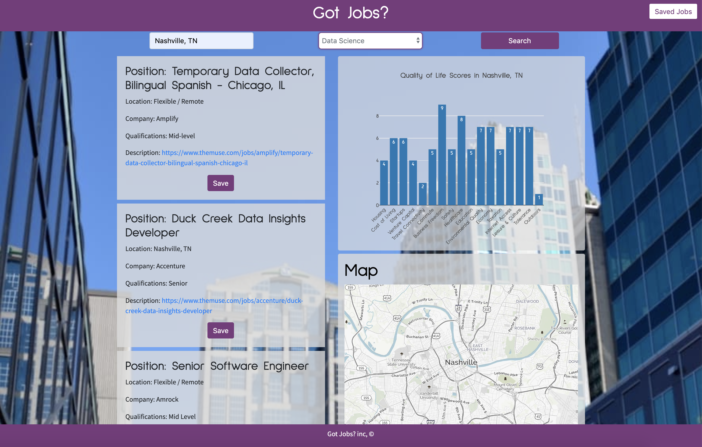

# Got Jobs?

For this project, we have been tasked with coming up with a webpage that would adhere to the following qualifications:

- Must use at least two server-side APIs
- Must use a CSS framework other than Bootstrap
- Must be interactive (i.e: accept and respond to user input)
- Use at least one new third-party API
- Must have a polished UI
- Must meet good quality coding standards
- Does not use alerts, confirms or prompts (look into modals)
- Must be deployed to GitHub Pages

With all of these qualifications in mind, our group decided that a job search website would be a good fit because we will all be looking for jobs in the next few months so it made the project a little more real for us to achieve. Not only does this page pull up job information, but it also allows the user to search various cities and see quality of life information, and a map of the city based off of the search parameters. 

### Server-Side APIs

In this application, we decided to use *themuse* and *Teleport* as our server side APIs. **Themuse**, given different search parameters, allowd us to pull job information based off of the parameters we chose. For our project, we decided to keep it simple and only select city and job type. When the user searches for a city and a job type, the page is populated with job results with the job title, city, company, qualifications, and job description. 

For **Teleport**, all that is needed is a city name and it can pull quality of life information for that city. The information can be anything from cost of living to leisure and comfort with so much in between. We thought it was appropriate to include this in our project because, if you are looking to relocate for a job, then it would be nice to know some general information about the city. 

The last server-side API we decided to use for our project was a **Mapquest** API that provides a map of the city that is searched. When relocating for a job, it can be nice to see where the job is located, even if it is just a general map of the city. That can provide a lot of information as to what kind of place you may be moving to if you land a job. 

### Third Party API

The third-party API we used for this project is **Plotly.JS**. Plotly is "a high-level, declarative charting library." This allows the page to display the city scores in an understandable format, a score from 0 to 10. Plotly has many different chart styles that can be customizable to the desired appearance.    

### Polished UI and Styling

Our page features a fairly responsive layout that reacts to many different screen sizes. We achieved this using **Bootstrap** as the main framework for styling using the built in grid system. Along with bootstrap, we also devloped our own class systems for styling that allowed for easy styling of the page. Another framework we decided to use was **Animate.css** as a way to make our page a little more exciting than the average job search website. The animate framework works similarly to the bootstrap in there is a class structure you can input into the html to allow for easy styling. 

### User Interface

Upon opening the page, the user will see "Got Jobs?" as the title of the website followed by a search bar. In that search bar, the user can put in two different parameters: city name, and job type. The city name can be any cities name, but the job type has to coincide with a dropdown menu due to limits with themuse API information. After the user enters the information they are looking for, a submit button with an "onclick" function will call out to the three APIs and populate the appropriate information. 

On the left side of the page, a series of job postings is populated based off of the AJAX call. On each job posting, there is a save button that can save the job posting into local storage. Once the job is saved, a star appears next to the job title showing indicating that the job posting has been saved. On the top right of the page, there is a "Saved Jobs" button that, when clicked, opens up a modal with a list of saved jobs. Each job has a delete button that removes the posting from local storage and there is also a clear all button that removes all saved job postings from local storage. Once the jobs are removed from local storage, the star is removed from the job posting and it is cleared from the modal. 

If there are no job postings for that city or job type, a card displays on the page saying that there are no job postings available. Also, if the name of a city is misspelled, a different card pops up giving an example of a correct search parameter.

-----------------------------------------------------------------------------------------------------------------------------------

On the right side of the page, a chart displays with all of the quality of life information from the **Teleport** API. This API only requires the city parameter from the search input and populates not only a chart, but it also changes the background of the website to a picture of the city that is searched. 

If the city is not within the database of Teleport, a card pops up that says that the cities information is not within the teleport database. 

-----------------------------------------------------------------------------------------------------------------------------------

Under the chart, the **Mapquest** API populates a map of the city that is searched. 

Here is the link to our GitHub Pages: https://jamiekook.github.io/GotJobs/

